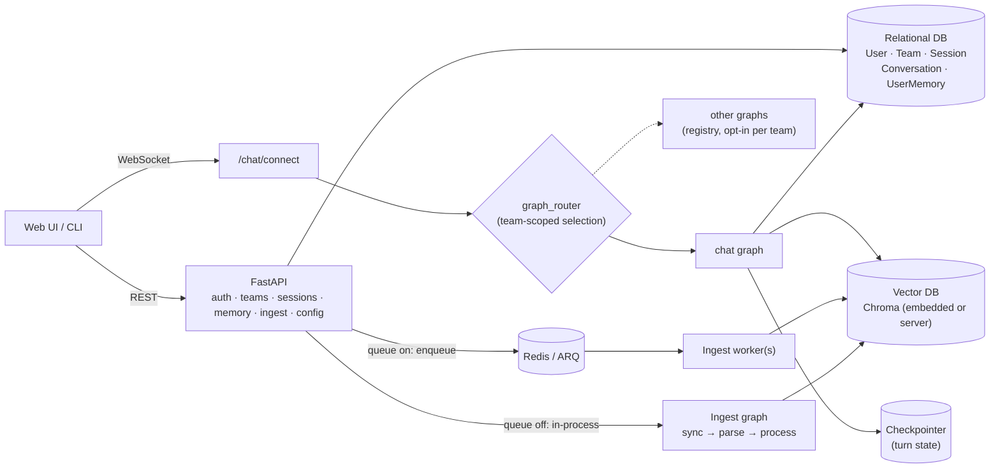

<p align="center"> <picture> <source media="(prefers-color-scheme: light)" srcset="https://ml2-ai-product.s3.ap-northeast-2.amazonaws.com/MARU/MARU_Black_full.png"> <source media="(prefers-color-scheme: dark)" srcset="https://ml2-ai-product.s3.ap-northeast-2.amazonaws.com/MARU/MARU_White_full.png">  </picture> </p> <p align="center"> <a href="https://opensource.org/licenses/MIT"></a>

# 🦊 MARU-Lang

**MARU** is an open-source **RAG (Retrieval-Augmented Generation) chatbot engine** built for **enterprise environments**.
The core principle behind MARU is **effective integration with existing corporate data** — the key to any successful enterprise RAG system.

To provide seamless user experiences and easy compatibility with enterprise infrastructure, MARU is designed to align with corporate document management and access systems — including first-class support for **Korean document formats (HWP/HWPX)**.
We open-sourced MARU to help developers who face similar real-world challenges in enterprise AI integration.

---

## 🚀 Features

### 📥 Ingest Pipeline (LangGraph: `sync → parse → process`)

- **Broad format support** — PDF, DOCX, PPTX, XLSX, CSV, HTML, JSON, Markdown, plain text/code, and **Korean documents (HWP / HWPX / HWPML)** parsed via the [KorDoc](https://github.com/chrisryugj/kordoc) MCP server
- **Pluggable parser routing** — LangChain loaders by default; route any share of dual-support formats (pdf/docx/xls/xlsx) to KorDoc with `kordoc_mcp_ratio` to A/B-compare parsing quality (the parser used is recorded in document metadata)
- **Change-aware re-upload** — documents are identified by (team, path); re-uploading a modified file **updates the document in place** (embeddings replaced), and `/ingest/check` skips unchanged files by fingerprint
- **Failure recovery** — failed documents keep their error message and are re-processed via the **retry API** (per document, or per folder in queue mode)
- **Safe deletion** — single-document and **folder-subtree** deletion with a cooperative-cancel state machine: in-flight ingests are marked `deleting` and finalized by the worker, so deletes never race embedding writes (chunks, DB rows, and storage files are all cleaned up)
- **Scales out with a task queue (optional)** — offload embedding to ARQ workers over Redis, with a shared **Chroma server** so the API and workers see one consistent vector store

### 💬 Chat Pipeline (LangGraph, single compiled graph per team scope)

- **Search/no-search routing** — a classifier node decides whether a question needs document retrieval (biased toward search for fact/regulation questions)
- **Memory-aware conversations** — user facts/preferences and rolling session summaries are loaded up front; follow-up questions ("그건요?") are rewritten into self-contained search queries using prior context
- **RAG with self-correction** — intent rewrite → keyword extraction → retrieval → sufficiency evaluation with retry → reranking (optional cross-encoder with `reranker_min_score` filtering)
- **Per-message team scoping** — document search is restricted to the requester's teams (and optionally a subset per message)
- **Feedback collection** — interrupt/resume flow for answer scoring and reasons, persisted per conversation
- **Observability** — every turn carries `user_id` / `team_ids` / `session_id` / `graph_id` into LangSmith traces and checkpoint metadata

### 🔐 Built-in Infrastructure

- **Auth** — access (2h) / refresh (30d) token flow, corporate email verification (SMTP OTP), domain allowlist, role hierarchy (anonymous / editor / admin)
- **Teams** — N:N membership, team-admin-gated destructive actions, invitation flow for not-yet-registered users
- **Sessions** — server-owned session ids; the last session is resumed only within a 7-day idle window (older conversations stay in history)
- **Audit trail** — upload / re-upload / delete / ingest success / ingest error per document

---

## 🏗️ Architecture

### System overview



- **Two routing levels**: `graph_router` (L1) picks which graph to run within the team's accessible set; each graph then routes internally (L2).
- **Ingest graph**: one compiled graph serves every entry point — CLI sync, API upload (in-process or via the ARQ worker), and retries.
- **Memory loop**: the chat graph reads memory up front (`context_builder`) and writes it back at the end (`summarize`, `memory_extractor`) — see below.

### Chat graph (auto-generated from the compiled graph)

> Regenerate with `python scripts/draw_graph.py` — traced from the actual `create_rag_graph()` topology.


- **context_builder** → loads user memory (facts/preferences) + session summary/recent turns.
- **route** → classifies search vs. direct answer.
- **search_entry → … → format** → RAG retrieval with an evaluate/retry loop.
- **generate** → produces the answer (with retrieved + memory context).
- **score/reason** → optional feedback collection (interrupt/resume).
- **summarize → memory_extractor** → write-back: turn/session summaries + durable user memory.

---

## 🧩 Getting Started

### Requirements

- **Python 3.10+**
- **Node.js / npx** — for Korean document parsing via KorDoc (set `kordoc_mcp_enabled: false` to run without it)
- **Docker** *(optional)* — Redis + Chroma server for the task-queue deployment mode

### 🔧 Installation

```bash
git clone https://github.com/kc-ml2/MARU-Lang.git
cd MARU-Lang

python -m venv venv && source venv/bin/activate
pip install -e .

maru install        # scaffolds maru_app/ with maru_config.yaml
```

### ⚙️ Configuration — `maru_app/maru_config.yaml`

One file configures everything. The keys you'll touch first:

```yaml
# --- LLM (OpenAI-compatible servers like vLLM work via the openai provider) ---
llms:
  - name: my-llm
    provider: openai          # openai | anthropic | google | ollama | vllm
    model_name: gpt-4o
    api_key: ${ENV:OPENAI_API_KEY}
    # base_url: http://my-vllm:8000/v1

# --- Embedding & retrieval ---
embedding_model: BAAI/bge-m3
retriever_top_k: 5
reranker_enabled: false       # cross-encoder reranking (+ reranker_min_score filter)

# --- Vector store ---
vector_db_url: chroma://data/chroma/maru          # embedded (single process)
# vector_db_url: chroma+http://localhost:8001/maru  # Chroma server (required for queue mode)

# --- Ingest task queue (optional) ---
task_queue_enabled: false     # true → embedding runs on ARQ workers (needs redis_url + Chroma server)
redis_url: redis://localhost:6379

# --- Korean document parser ---
kordoc_mcp_enabled: true      # hwp/hwpx/hwpml via KorDoc MCP (needs Node/npx)
# kordoc_mcp_ratio: 0.0       # share of pdf/docx/xls/xlsx routed to KorDoc (A/B comparison)
```

`${ENV:VAR}` / `${ENV:VAR:default}` interpolation is supported throughout.

### ▶️ Running

**Simplest — single process (embedded Chroma, in-process embedding):**

```bash
maru run            # API server + interactive chat REPL in one command
```

**Production-style — task queue with shared stores:**

```bash
# one-time: shared infrastructure
docker run -d --name maru-redis  --restart unless-stopped -p 6379:6379 redis:7
docker run -d --name maru-chroma --restart unless-stopped -p 8001:8000 \
  -v $HOME/maru-chroma-data:/data chromadb/chroma

# maru_config.yaml: task_queue_enabled: true, vector_db_url: chroma+http://localhost:8001/maru
maru serve --worker 1          # API + co-launched ARQ ingest worker (use under systemd)
maru run --attach              # attach a chat REPL to the running server (same machine)
```

**Chat REPL commands:** `/team` switch teams · `/ingest <path>` upload & embed · `/status` document states · `/retry [force]` re-process failed (or all) docs · `/llms` · `/function feedback` · `/help`

### 📚 API

- Interactive docs: `http://localhost:8000/docs` (Swagger)
- Guides for frontend integration:
  - [`docs/ingest-api.md`](docs/ingest-api.md) — upload / status / check / retry / delete (incl. folder-level operations and the queue processing model)
  - [`docs/teams-api.md`](docs/teams-api.md) — teams, members, invitations
- `GET /config` returns client bootstrap data — including `supported_extensions`, computed from the **current parser configuration** (Korean formats appear only when KorDoc is enabled)

---

## 🎤 Presentations

MARU was presented at 👉 [Open Source Summit Korea 2025](https://osskorea2025.sched.com/event/29141/making-rag-chatbots-enterprise-ready-group-permissions-and-pluggable-backends-jinmyoung-lee-sunyoung-park-kc-ml2-jihoon-kim-kc-co-ltd?iframe=yes&w=100%&sidebar=yes&bg=no), _Making RAG Chatbots Enterprise-Ready: Group Permissions and Pluggable Backends_.

## 🪪 License

Distributed under the **MIT License**

## 🤝 Contributing

We welcome contributions from the community!
Feel free to:

- Open an issue for bugs or suggestions
- Submit a pull request for improvements
