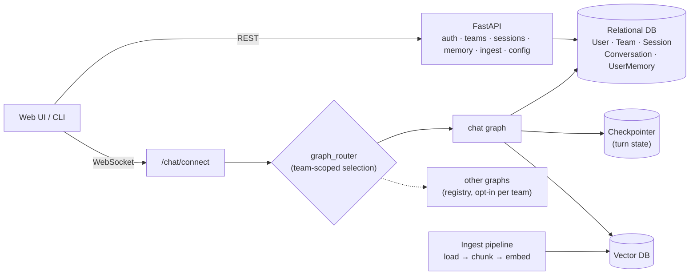
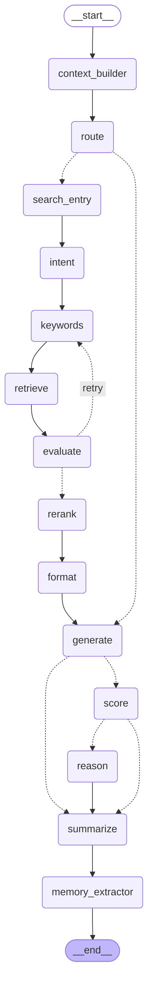

<p align="center"> <picture> <source media="(prefers-color-scheme: light)" srcset="https://ml2-ai-product.s3.ap-northeast-2.amazonaws.com/MARU/MARU_Black_full.png"> <source media="(prefers-color-scheme: dark)" srcset="https://ml2-ai-product.s3.ap-northeast-2.amazonaws.com/MARU/MARU_White_full.png">  </picture> </p> <p align="center"> <a href="https://opensource.org/licenses/MIT"></a>

# 🦊 MARU-Lang

**MARU** is an open-source **RAG (Retrieval-Augmented Generation) chatbot engine** built for **enterprise environments**.
The core principle behind MARU is **effective integration with existing corporate data** — the key to any successful enterprise RAG system.

To provide seamless user experiences and easy compatibility with enterprise infrastructure, MARU is designed to align with corporate document management and access systems.
We open-sourced MARU to help developers who face similar real-world challenges in enterprise AI integration.

---

## 🚀 Features & Architecture

MARU includes all the essentials to build an enterprise-ready RAG chatbot.
Once you connect the chatbot web UI, MARU operates through two main pipelines:

### 📥 Ingest Pipeline

Handles document processing and embedding generation — **core functionality included, fully customizable**:

- **Document Upload & Management**

  - Users upload documents and folders through the web interface
  - OS-like document system with automatic permission handling
  - Integrates with existing corporate file structures

- **Customizable Processing Chain**
  - **Loaders**: Parse different file types (PDF, DOCX, etc.) — extend for proprietary formats
  - **Chunkers**: Define document splitting strategies — optimize for your use case
  - **Embedders**: Generate vector embeddings — connect to any embedding provider
  - Processed documents become instantly available for RAG queries

### 💬 Chat Pipeline

Powers intelligent query processing and response generation — **core functionality included, fully customizable**:

- **Query Understanding**

  - Analyzes user intent and conversation context
  - Automatically selects the most appropriate tools and workflows

- **Customizable Intelligence Layer**
  - **RAG Retrieval**: Searches relevant documents with permission-aware filtering
  - **Rerankers**: Fine-tune search result ranking for improved accuracy
  - **Agents**: Execute specialized tasks
  - **MCP (Model Context Protocol)**: Advanced contextual workflows
  - **LLMs**: Generate responses using your preferred language model

### 🔐 Built-in Infrastructure

- **Authentication**: Token-based system with corporate email verification
- **Easy Setup**: Run MARU with minimal configuration
- **Extensibility**: Customize any component while keeping the core stable

---

## 🏗️ Architecture

### System overview



- **Two routing levels**: `graph_router` (L1) picks which graph to run within the team's accessible set; each graph then routes internally (L2).
- **Memory loop**: the chat graph reads memory up front (`context_builder`) and writes it back at the end (`summarize`, `memory_extractor`) — see below.

### Chat graph (auto-generated from the compiled graph)

> Regenerate with `python scripts/draw_graph.py` — traced from the actual `create_rag_graph()` topology.



- **context_builder** → loads user memory (facts/preferences) + session summary/recent turns.
- **route** → classifies search vs. direct answer.
- **search_entry → … → format** → RAG retrieval with an evaluate/retry loop.
- **generate** → produces the answer (with retrieved + memory context).
- **score/reason** → optional feedback collection (interrupt/resume).
- **summarize → memory_extractor** → write-back: turn/session summaries + durable user memory.

---

## 🧩 Getting Started

### 🔧 Installation

```bash
# Clone the repository
git clone https://github.com/your-username/MARU-Lang.git
cd MARU-Lang

# Install dependencies
pip install -e .

# Initialize MARU
maru install
```

### ⚙️ Configuration

Once MARU installed, navigate to the `maru_app/` directory — **everything here is fully customizable**.

💡 All components come with example `.yaml` templates and sample implementations for easy customization.

#### Ingest Pipeline

- **`/loaders`** — Document parsers for different file types
- **`/chunkers`** — Document chunking strategies
- **`/embedders`** — Embedding model configurations

#### Chat Pipeline

- **`/llms`** — LLM service connections
- **`/rerankers`** — Search result ranking configurations
- **`/agents`** — Agent logic and custom implementations
- **`/agents/mcps`** — MCP (Model Context Protocol) integrations

#### System Configuration

- **`rag_config.yaml`** — End-to-end RAG workflow settings
- **`build_selector.yaml`** — Component selection rules (auto-select agent/MCP)
- **`system_config.yaml`** — Global system settings (database, storage, services)

### ▶️ Running MARU

```bash
# start running MARU !
maru serve
```

Access MARU at http://localhost:8000

### 💻 Web UI Integration

MARU can be connected to a web-based front-end for a full user experience.
You can integrate any custom UI framework or use our reference implementation.

### 📚 API Documentation

Explore MARU’s REST API endpoints in: `/maru_lang/api/endpoints`
You can customize these endpoints to integrate MARU seamlessly into your existing systems.

---

## 🎤 Presentations

MARU was presented at 👉 [Open Source Summit Korea 2025](https://osskorea2025.sched.com/event/29141/making-rag-chatbots-enterprise-ready-group-permissions-and-pluggable-backends-jinmyoung-lee-sunyoung-park-kc-ml2-jihoon-kim-kc-co-ltd?iframe=yes&w=100%&sidebar=yes&bg=no), _Making RAG Chatbots Enterprise-Ready: Group Permissions and Pluggable Backends_.

## 🪪 License

Distributed under the **MIT License**

## 🤝 Contributing

We welcome contributions from the community!
Feel free to:

- Open an issue for bugs or suggestions
- Submit a pull request for improvements
